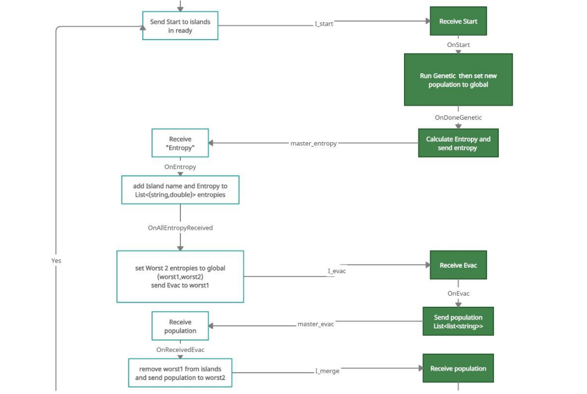

# Traveling Salesman Problem (TSP) Solver Using Population-Merging Island Model (PMIM)
This project implements the **Population-Merging Island Model (PMIM)** for solving the **Traveling Salesman Problem (TSP)**, based on the paper:

> **Javier Arellano-Verdejo Et al.**, *"A New Efficient Entropy Population-Merging Parallel Model for Evolutionary Algorithms"*, International Journal of Computational Intelligence Systems, Vol. 10 (2017) 1186–1197.


## Table of Contents

- [Project Overview](#project-overview)
- [Key Features](#key-features)
- [Technologies](#technologies)
- [Configuration](#configuration-parameters)
- [Architecture](#architecture)
- [Running The Project](#running-the-project)
- [Results](#example-output)


## Project Overview

This project implements a **parallel island model** for evolutionary algorithms to solve the TSP. The model uses **entropy-based population merging** to maintain diversity and accelerate convergence toward an optimal solution. It distributes the workload across multiple worker nodes, communicating via **RabbitMQ**, and follows an **event-driven** architecture.


## Key Features

- **Parallel Island Model**: Each worker (island) independently evolves its population.
- **Entropy-Based Diversity Management**: Uses Shannon entropy to evaluate and maintain population diversity.
- **Dynamic Population Merging**: Merges populations from the two least-diverse islands during each iteration.
- **RabbitMQ Communication**: Efficient master-worker communication.
- **Event-Driven Architecture**: Implements event-based triggers for seamless coordination.
- **Extensible and Configurable**: Allows easy modification of evolutionary algorithm parameters and system scale.

## Technologies

- .NET 6.0
- TPL Dataflow (Task Parallel Library)
- LINQ for functional programming
- RabbitMQ
- Events
- XPlot.Plotly for visualization


## Configuration Parameters

Here is a detailed description of the configuration parameters in the `app.config` file for the master application. These settings control various aspects of the genetic algorithm, population merging, and parallelism in the system.

- **SelectionMethod**: Specifies the selection method used in the genetic algorithm for choosing individuals for reproduction.  
  Possible values:  
  - `Roulette`: Selection is based on a roulette wheel method where the probability of selection is proportional to fitness.  
  - `Tournament`: Selection is based on a tournament where individuals compete for reproduction.

- **CrossOverMethod**: Defines the crossover method for combining genetic material from two parents to produce offspring.  
  Possible values:  
  - `GX5`: Greedy crossover method (Greedy CrossOver5), which is a specialized crossover approach to maintain the best genes.  
  - `OX1`: Ordered Crossover, where the order of genes is preserved between the parents and offspring.  
  - `CrossOver1Points`: Single-point crossover, where a single point is selected and all genes after that point are swapped between parents.  
  - `CrossOver2Points`: Double-point crossover, where two points are selected and the genes between those points are swapped.

- **MutationMethod**: Specifies the mutation technique used to introduce genetic diversity in the population.  
  Possible values:  
  - `Swapping`: Gene swapping mutation, where two genes in an individual are swapped.  
  - `Inversion`: Inversion mutation, where the order of a subset of genes is reversed.

- **EvalMethod**: Defines the method for evaluating individuals' fitness.  
  Possible values:  
  - `Distance`: The fitness is calculated based on the total distance traveled in the Traveling Salesman Problem (TSP), where shorter distances are favored.

### Data Path

- **data_path**: Path to the dataset used for solving the problem (e.g., `99.csv`), which contains the city coordinates or problem-specific data.

### Hyperparameters of Genetic Algorithm

- **PopulationSize**: The number of individuals (chromosomes) in the population for each generation. Default is `400`.

- **mutationProbability**: The probability that a mutation will occur on an individual in each generation. Default is `0.3` (30%).

- **ElitesRatio**: The ratio of the elite individuals that are directly passed to the next generation without modification. Default is `0.3`, meaning 30% of the population will be elite individuals.

- **isClosedLoop**: A boolean value (`true` or `false`) indicating whether the problem is a closed-loop problem (TSP where the first and last cities are connected). Default is `true`.

- **StartingCity**: Specifies the city where the tour starts. Default is `1`, indicating the first city in the dataset.

- **EndingCity**: Specifies the city where the tour ends. Default is `1`, indicating the first city.

### Tournament Selection Parameters

- **tournamentSampleSize**: The fraction of the population selected to participate in the tournament for selection. Default is `0.05` (5% of the population).

- **winningProbability**: The probability that a randomly selected individual from the tournament will win. Default is `0.7`, meaning a 70% chance for the fittest individual to win.

### Island and Entropy Calculation Settings

- **Islands**: A comma-separated list of island names (e.g., `I1,I2,I3,I4`). Each island represents a parallel subpopulation running its own genetic algorithm.

- **numberOfGenerationsBetweenMergers**: The number of generations to run on each island before merging populations from the least diverse islands. Default is `400` generations.

- **BinsNo**: Specifies the number of bins used in Shannon entropy calculations for measuring the diversity of the population on each island. This value helps compute the entropy, which is used to measure population diversity. Default is `10`.

### Parallelism Settings (TPL)

- **MaxDegreeOfParallelism**: Controls the maximum number of threads that can run in parallel. `-1` indicates no limit (i.e., use the maximum available threads based on the system's capacity).

- **BoundedCapacity**: Sets the maximum number of tasks that can be queued for execution. `-1` means no limit, allowing an unlimited number of tasks to be queued.


These configuration parameters allow fine-tuning of the genetic algorithm's behavior, including how the evolutionary process runs, the diversity of the population, and the parallelism of task execution. The master application uses these settings to control the genetic algorithm's execution on the worker islands, population merging, and entropy-based evaluation of the islands' performance.


## Architecture





### Workflow

1. **Initialization**:
   - Master initializes the population and sends it to all worker islands.
   - Workers set up their local environment and confirm readiness.

2. **Evolution**:
   - Workers independently run genetic algorithms on their populations.
   - Entropy is calculated and sent to the master.

3. **Merging**:
   - Master identifies the two islands with the lowest entropy.
   - Population from the worst-performing island is merged into the second-worst island.

4. **Termination**:
   - When only one island remains, the final solution is sent to the master.

### System Components

- **Master Application**: Orchestrates population initialization, entropy collection, merging, and termination.
- **Worker Applications**: Handle genetic algorithm execution and entropy calculation.
- **RabbitMQ**: Facilitates communication between the master and workers.

## Running the Project

Follow these steps to set up and run the Population-Merging Island Model (PMIM) for solving the Traveling Salesman Problem (TSP):

### 1. Start RabbitMQ Server

To start the RabbitMQ server, you can use Docker. Follow the instructions in the link below to install and configure RabbitMQ on your system:

[How to set up RabbitMQ on Windows Or Linux with Docker](https://gregorbowie.wordpress.com/2020/01/31/rabbitmq-on-windows-with-docker/)

After running the RabbitMQ container, you should be able to access the RabbitMQ management interface at:

- **Management Interface**: [http://localhost:15672](http://localhost:15672) (default username/password: `guest`/`guest`)

### 2. Start Worker Instances

Run multiple instances of the **Worker** application. The number of instances you run is up to you and can be adjusted depending on how many islands you want to simulate. Open separate terminal windows and run the Worker app in each one:

```bash
dotnet run
```
### 3. Enter Island Numbers

For each worker instance, when prompted, enter the island number. For example:

    Worker 1: Enter I1
    Worker 2: Enter I2
    Worker 3: Enter I3
    Worker 4: Enter I4

Make sure the number of islands entered matches the number of worker instances you have running.
### 4. Configure the Master Application

In the Master application, open the config file **app.config** and specify the necessary hyperparameters for the genetic algorithm, such as population size, mutation rate, crossover method, etc.

Refer to the Configuration Parameters section for details on each setting.

### 5. Enter Island Names

In the Master application, enter the names of the islands in the config file (e.g., I1,I2,I3,I4). Ensure that the number of islands specified is equal to or less than the number of worker instances you started in step 2.

```xml
<add key="Islands" value="I1,I2,I3,I4"/>
```
### 6. Run the Master Application

Once the RabbitMQ server is running and all worker instances are started, you can run the Master application:

```bash
dotnet run
```
The master will begin coordinating the population merging and evolutionary process, while the worker instances will perform the genetic algorithm computations. The system will continue to run until a final solution is found.

## Example Output


